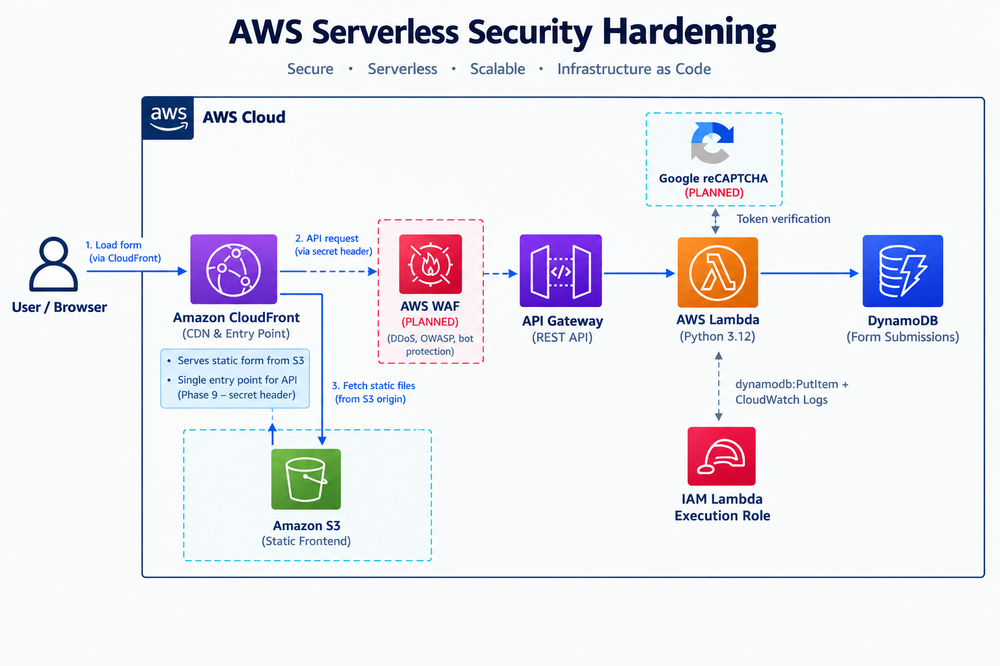

# AWS Serverless Security Hardening

A serverless web application built on AWS, progressively hardened against API abuse, injection attacks, and automated traffic. This project applies IAM least privilege, WAF-based request filtering, server-side validation, and Infrastructure as Code to a public-facing form submission API.

The architecture mirrors a real production incident I managed in year one, where an automated script via a vulnerability scanner bypassed a public-facing web portal's frontend entirely and submitted malicious records directly to the API. This project reconstructs that system on AWS, demonstrates the vulnerable state, and applies the same class of controls that resolved the original incident.

---

## Status

| Component | Status |
|---|---|
| AWS account and baseline security | Completed |
| DynamoDB | Completed |
| Lambda backend | Completed |
| API Gateway | Completed |
| IAM role and permissions | Completed |
| Terraform (IaC) | In Progress |
| AWS WAF | Planned |
| IP-based access restriction | Planned |
| Server-side reCAPTCHA validation | Planned |
| CSP response headers | Planned |
| CloudFront distribution and S3 frontend | Planned |
| Security testing and attack simulation | Planned |
| Monitoring and logging | Planned |

---

## Architecture



---

## Why I Built This

During a production incident, an automated attack script bypassed frontend validation and submitted thousands of malicious records directly to the API. All CAPTCHA and input validation existed only in the browser. The attacker never touched the browser.

This project exists to work through that failure from first principles on AWS: build the vulnerable state deliberately, demonstrate the attack, then apply controls layer by layer and prove each one works. The goal is not to follow a checklist of AWS services. It is to understand why each control exists and what the system looks like without it.

The skills this develops in practice:

- AWS serverless architecture and service integration
- IAM design and least privilege enforcement
- API design and security at the gateway layer
- Server-side validation patterns
- WAF rule management and testing
- Infrastructure as Code with Terraform
- Python automation and boto3
- Systematic security hardening and evidence-based testing

---

## Technologies

| Technology | Role |
|---|---|
| AWS Lambda | Serverless compute, form processing, validation logic |
| API Gateway | Public HTTPS endpoint, request routing, CORS |
| DynamoDB | NoSQL storage for form submissions |
| IAM | Role-based access control, least privilege enforcement |
| AWS WAF | Request filtering, OWASP rule groups, rate limiting |
| Terraform | Infrastructure as Code, resource provisioning |
| Python 3.12 | Lambda runtime, attack simulation script |
| boto3 | AWS SDK for DynamoDB interaction |
| AWS CLI | Credential management, local development |
| Git / GitHub | Version control, project documentation |

---

## Implementation

### DynamoDB

Stores form submissions. Each record uses a randomly generated UUID (`uuid4`) as the partition key, ensuring no two submissions collide regardless of content. Billing mode is on-demand: no capacity planning needed at this scale, and cost scales directly with usage.

### Lambda

A Python 3.12 function that receives the API Gateway proxy event, parses the request body, constructs a submission record, and writes it to DynamoDB using `table.put_item()`.

The DynamoDB table name is injected as an environment variable at deploy time. The function never has the table name hardcoded. This pattern extends to secrets: in a later phase the reCAPTCHA secret key will be passed the same way.

The current function has no request validation. This is deliberate. The unvalidated state is the baseline the attack simulation runs against.

### API Gateway

A REST API with a POST method on `/submit`. REST API is chosen over HTTP API specifically because AWS WAF can only be attached directly to a REST API stage.

The OPTIONS method uses a MOCK integration to handle CORS preflight without invoking Lambda. The integration uses Lambda proxy mode: the full HTTP request is forwarded to Lambda as the event dictionary, and Lambda returns a complete HTTP response.

### IAM

Lambda assumes an execution role with two permission statements:

`dynamodb:PutItem` on this specific table ARN only. Lambda cannot read, scan, query, update, or delete records. If the function is compromised, the blast radius is limited to writing new items.

`logs:CreateLogGroup`, `logs:CreateLogStream`, `logs:PutLogEvents` for CloudWatch. Lambda cannot access any other AWS service.

---

## Security Design

### IAM Least Privilege

The Lambda execution role grants the minimum permissions required for the function to operate. No wildcard actions, no broad resource ARNs. The permission policy is scoped to a single action on a single resource.

### Environment Variables for Configuration

Sensitive values and environment-specific configuration are passed to Lambda via environment variables at deploy time. Nothing is hardcoded in the function source. In a later phase, the reCAPTCHA secret key follows the same pattern.

### API Gateway as the Entry Point

Lambda does not have a public URL. All requests reach Lambda through API Gateway, which provides a stable HTTPS endpoint, handles CORS, and will serve as the WAF attachment point.

### WAF Placement (Planned)

WAF will be attached at two positions: on the API Gateway stage, and on a CloudFront distribution in a later phase. Positioning WAF only at the CDN layer was the failure mode in the original incident: the attacker bypassed the CDN and hit the API directly. Both layers are required.

### Server-Side reCAPTCHA (Planned)

The original incident had a client-side CAPTCHA only. An automated script running in Python does not execute JavaScript and has no browser context. The CAPTCHA was irrelevant to the attack. Lambda will verify every token with Google's API before writing anything to DynamoDB. A request with no valid token returns 400 without touching the database.

### CSP Headers (Planned)

Content Security Policy will be configured at the CloudFront layer to restrict which domains the browser is permitted to load scripts from and connect to. This is the last line of defence against stored XSS payloads.

---

## Infrastructure as Code

Terraform provisions all AWS resources in this project. No resources are created manually through the console except for the initial IAM admin user and AWS budget alert, which are one-time account setup steps.

Resources currently managed by Terraform:

- DynamoDB table
- Lambda function, execution role, and permissions policy
- API Gateway REST API, resource, methods, integrations, deployment, and stage

Resources being migrated to Terraform:

- WAF Web ACL and rules
- CloudFront distribution and S3 bucket (later phase)

---

## Security Testing / Hardening

The project is structured as a before and after demonstration. All testing is conducted against infrastructure in my own AWS account.

**Planned progression:**

1. Deploy the baseline application with no security controls beyond IAM
2. Add IP-based restriction to limit the API to the test machine only
3. Run the attack simulation script: SQLi payloads, XSS payloads, high-volume requests
4. Record the before state: all payloads land in DynamoDB, volume requests succeed
5. Add WAF with OWASP managed rule groups and rate limiting, re-run, observe what is blocked
6. Add server-side reCAPTCHA in Lambda, re-run, observe that requests with no valid token are rejected regardless of WAF
7. Add CSP headers and CloudFront secret header, run final simulation, confirm zero records created

---

## Key Engineering Decisions

**Why API Gateway instead of a Lambda function URL?**

Lambda function URLs do not support WAF attachment. The two-layer WAF defence requires REST API Gateway. The additional complexity is the cost of that control.

**Why Lambda instead of a running server?**

A form submission API handles infrequent, short-lived requests. Lambda charges per invocation and per millisecond of execution time. An EC2 instance would idle continuously and cost more for the same workload.

**Why DynamoDB instead of RDS?**

RDS requires a VPC, subnets, a subnet group, and security groups before the database exists. DynamoDB is serverless: reference it by ARN, grant Lambda permission to write to it, and it is ready. For a key-value record store with no relational data model, the additional complexity of RDS provides no benefit.

**Why IAM is scoped to PutItem only?**

The principle of least privilege. Lambda processes inbound submissions and writes them. It has no operational reason to read, modify, or delete records. Granting broader permissions would increase the blast radius of a function compromise without providing any application benefit.

**Why WAF at two layers?**

The original incident failed partly because WAF was positioned only at the CDN layer. The attacker bypassed the CDN and sent requests directly to the API. WAF at the API Gateway stage catches those requests independently.

**Why Terraform?**

Manual console deployments are not reproducible. Terraform codifies every infrastructure decision, makes changes reviewable before they are applied, and allows the entire environment to be destroyed and rebuilt identically.

---

## Troubleshooting / Lessons Learned

---

### Serverless Runtime Has No Access to Local Files

**Problem**

When configuring Lambda to write to DynamoDB, I assumed the table name could be passed the same way local Python applications read from a `.env` file, or referenced directly from `terraform.tfvars` or the Terraform state file.

**Investigation**

I asked whether `terraform.tfvars` could serve as a runtime configuration source for Lambda, then whether the state file could be referenced instead. Both questions came from thinking about this as a local application problem where the program and its config share the same file system.

**Root Cause**

Lambda does not run on your local machine. It runs on a managed server in AWS that has no access to your local file system, your `terraform.tfvars`, or your state file. Those files exist only on your machine during `terraform plan` and `terraform apply`. Once the function is deployed, they play no role in what Lambda can access at runtime.

**Resolution**

Environment variables are injected into the Lambda runtime at deploy time via the `environment` block in `lambda.tf`. Terraform reads the value from `terraform.tfvars` during apply, passes it to AWS, and AWS stores it against the function. Lambda reads it at execution time using `os.environ['DYNAMODB_TABLE_NAME']`. The local file never touches the Lambda container.

**Lesson**

Serverless changes the contract between configuration and code. In traditional application development the program and its config share a file system. In serverless there is no shared file system. Any value Lambda needs at runtime must be provided through AWS-managed mechanisms: environment variables for non-sensitive config, Secrets Manager or Parameter Store for secrets. Configuration does not live next to the code. It lives in the infrastructure layer and is handed to the code at invocation.

### Lambda Permission and IAM Are Two Separate Permission Systems

**Problem**

API Gateway returned a 403 when attempting to invoke Lambda despite Lambda having a correctly configured IAM execution role.

**Investigation**

The IAM role was confirmed to exist with the correct trust policy and permissions. The issue was not with what Lambda could do but with whether Lambda could be called at all.

**Root Cause**

There are two distinct permission systems at play. IAM grants Lambda permission to call other AWS services — DynamoDB, CloudWatch, and so on. `aws_lambda_permission` grants external AWS services permission to invoke Lambda itself. These are not the same thing and neither covers the other. Lambda's IAM role says nothing about who can trigger the function.

**Resolution**

Added `aws_lambda_permission` to `api_gateway.tf` with `principal = "apigateway.amazonaws.com"` and `source_arn` scoped to the API's execution ARN. This explicitly grants API Gateway the right to invoke the function.

**Lesson**

IAM controls what Lambda can do. `aws_lambda_permission` controls who can call Lambda. Both must exist. A Lambda function with a perfect IAM role but no resource-based permission will reject every invocation from API Gateway with a 403. Always check both permission layers when debugging invocation failures.

### Terraform Does Not Roll Back on Failure

**Problem**

`terraform apply` failed partway through with an error on `aws_api_gateway_integration_response`. Resources created before the failure remained in AWS with no way to automatically undo them.

**Investigation**

After the error, the AWS console showed that some resources existed and some did not. It was unclear whether re-running apply would duplicate the resources that had already been created or cause further errors.

**Root Cause**

Terraform is not transactional. When an apply fails, it does not roll back the resources that already succeeded. The state file is updated to reflect what was created before the failure. Everything after the point of failure is simply not created.

**Resolution**

Fixed the error, added `depends_on = [aws_api_gateway_integration.cors_integration]` to the integration response to ensure the parent integration existed before the response was created, then ran `terraform apply` again. Terraform read the state file, identified what already existed, skipped those resources, and only created what was missing.

**Lesson**

A failed `terraform apply` is always safe to retry after fixing the underlying error. Terraform will never duplicate resources that already exist in state. The state file is the source of truth. This is why protecting the state file matters. If it is lost or corrupted, Terraform loses track of what exists and risks creating duplicates or failing to manage existing resources.

---

## Roadmap

- [x] AWS account setup, MFA, IAM admin user, budget alert
- [x] DynamoDB table provisioned with Terraform
- [x] Lambda function deployed and tested
- [x] API Gateway REST API with POST and OPTIONS, tested with curl
- [x] IAM execution role with least privilege permissions
- [ ] IP-based access restriction for testing phase
- [ ] Attack simulation script and before-state evidence
- [ ] AWS WAF with OWASP managed rules and rate limiting
- [ ] Server-side reCAPTCHA validation in Lambda
- [ ] CloudFront distribution and S3 static frontend
- [ ] CSP response headers via CloudFront
- [ ] CloudFront secret header to close direct API bypass
- [ ] After-state evidence and attack simulation comparison
- [ ] Monitoring and CloudWatch log review
- [ ] Final architecture documentation and Loom walkthrough

---

## Repository Structure

```
aws-defence-in-depth-incident-rebuild/
├── terraform/
│   ├── main.tf
│   ├── variables.tf
│   ├── outputs.tf
│   ├── dynamodb.tf
│   ├── iam.tf
│   ├── lambda.tf
│   ├── api_gateway.tf
│   ├── waf.tf              (planned)
│   ├── s3.tf               (planned)
│   └── cloudfront.tf       (planned)
├── lambda/
│   └── handler.py
├── scripts/
│   └── attack.py           (planned)
├── evidence/
│   ├── before/
│   └── after/
└── README.md
```

---

## What This Project Demonstrates

| Skill | How it is demonstrated |
|---|---|
| Cloud architecture | Serverless multi-service architecture with clear separation of concerns |
| AWS | Lambda, API Gateway, DynamoDB, IAM, WAF, CloudFront provisioned and integrated |
| IAM / RBAC | Execution role scoped to a single action on a single resource |
| Python automation | Lambda handler, boto3 integration, attack simulation script |
| API design | REST API with proxy integration, CORS, method-level configuration |
| Infrastructure as Code | Terraform provisioning all resources from state files |
| Security hardening | Progressive control implementation with before and after evidence |
| Troubleshooting | Real incident context, systematic diagnosis and remediation |
| Documentation | Architecture decisions documented with reasoning, not just descriptions |
